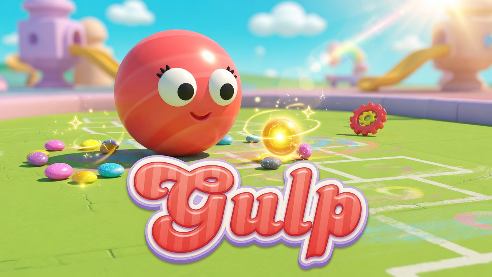

# Gulp

**Eat. Grow. Split. Don't get gulped.**

A mobile-first multiplayer arena in [Decentraland](https://decentraland.org/). Drop in, roll around as a candy blob, and try to become the biggest sphere in the park.

  

Play now: **[gulp.dcl.eth](https://decentraland.org/jump/?realm=gulp.dcl.eth)**

Works on [Decentraland Mobile](https://decentraland.org/) (iOS / Android) and desktop. Avatars are hidden — everyone is a blob.

---

## Gameplay

Gulp is a live, always-on eat-or-be-eaten game. You spawn as a small sphere in a circular candy playground. Pellets scatter across the grass. Other players (and wandering bots) are out there too. Bigger blobs gulp smaller ones. The bigger you get, the slower you roll — so a tiny, hungry sphere can still outrun a giant.

There is no round timer and no lobby. Walk in, play, leave, come back. The arena keeps running.

### Grow

- Roll over **pastel pellets** to gain mass.
- A blob can gulp another blob only if it is **about 5% heavier** and overlaps it.
- Eat every piece of a player and they pop, then respawn after a few seconds.
- Your all-time best mass is saved on the **leaderboard**. Food eaten and players eaten are tracked separately.

### Split and combine

Once you are heavy enough, **split** into extra blobs (up to 8). Pieces shoot forward, cover more ground, and can nibble several targets at once — but each piece is smaller, so a rival can pick them off.

**Combine** pulls your pieces back into one sphere when you want the safety of a single big blob.

### Power-ups

| Pickup | Look | What it does |
| --- | --- | --- |
| Pellet | Small pastel candy | Adds mass |
| Speed boost | Pulsing gold sphere | Doubles your speed for a few seconds. Stack more golds for a bigger burst. |
| Spikes | Pink spiked sphere | Armors you for a few seconds. If a bigger blob tries to gulp you, they get knocked back and shredded instead. |

### Hazards

The park is not empty.

- **Spinners** roam the grass. Touch one and you get shredded — mass halved.
- **Giant candy canes** ring the arena. Hit one and you bounce hard.
- **The outer wall** is a circle. Run into it and you rebound.
- Optional **flamingo pushers** (host-toggled) knock blobs around for chaos.

Die, watch the burst, and you are back in the arena shortly. You start small again and hunt.

### Bots

Named wanderers (Pip, Dot, Nib, and friends) keep the park busy when the room is quiet, so a solo visitor still has someone to chase — or flee.

---

## How to play

Built for a phone in one hand.

| | Mobile | Desktop |
| --- | --- | --- |
| Move | On-screen joystick | WASD / arrows |
| Split | **Split** button | Space / jump |
| Combine | **Combine** button | Combine button |
| Look | Drag to orbit the camera | Drag / pointer-lock |
| Stats | Trophy icon (top right) | Same |

The camera follows your blob from above. It zooms out as you grow so you can still see the field.

A short splash screen plays on join. After that you are live. If you get eaten, the game tells you who gulped you, then respawns you.

A round candy reef — lollipops, jelly arches, lantern mushrooms, coral posts — wraps the playground. Sky is locked to noon, avatars and nametags are off, and the only things moving are blobs, food, and hazards.
